# Frontend Labs

这是一个探索「人 + AI」如何协作制作精美前端页面的实验仓库。这里既保存网页，也保存从参考分析、视觉素材制作、动效实现、浏览器检查到复盘的过程。目标是找到人负责审美判断与验收、AI 辅助设计和实现的可重复工作流。

## 实验方法

1. 选定参考与目标：用截图、录屏和文字确定构图、排版、颜色、镜头运动及交互边界。
2. 拆解并准备素材：分别分析图片、视频和 3D 模型在网页中的作用；先在目标视口里验证素材是否合适。
3. 做最小可运行页面：先完成一个能判断方向的视觉片段，再扩展到完整页面或更多章节。
4. 在真实浏览器中迭代：检查桌面与移动布局、正向和反向滚动、素材加载及交互反馈，对照参考继续调整。
5. 记录结果：保留可运行页面、制作过程和失败原因，让下一轮实验能从具体证据出发。

这套流程来自本仓库的 [Lab 2 工作流草案](labs_2/workflow.md)与[实验复盘](labs_2/retrospective.md)。当前各实验的技术路线不同，并非统一的前端模板。

## 实验一：建筑空间的连续滚动镜头

[进入 `labs_1`](labs_1/) · [实验说明](labs_1/README.md) · [动效分析](labs_1/MOTION_ANALYSIS.md)

基于参考录屏，用三张统一风格的建筑画面构造从外观、临水走廊到木饰面室内的连续推进。页面采用原生 HTML、CSS、JavaScript 和 Web Animations API；滚动距离驱动画面与标题的时间轴，支持反向滚动。

下方是浏览器中的三个滚动阶段，而不是素材原图：

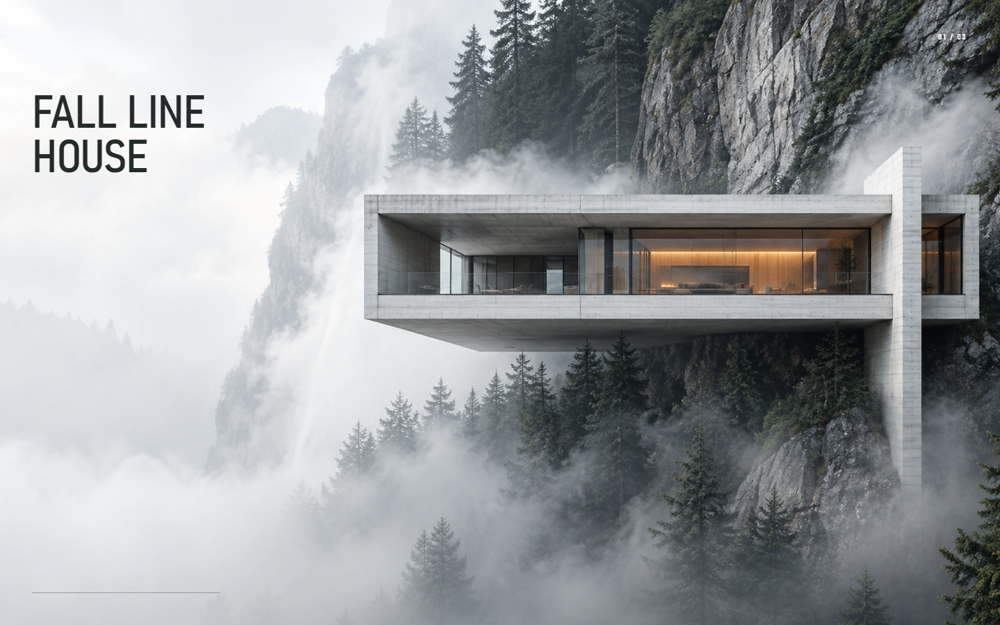
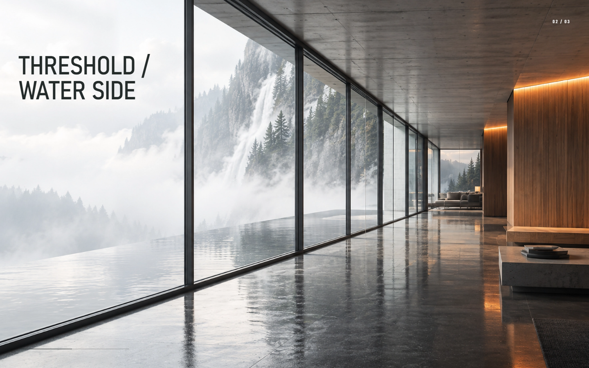
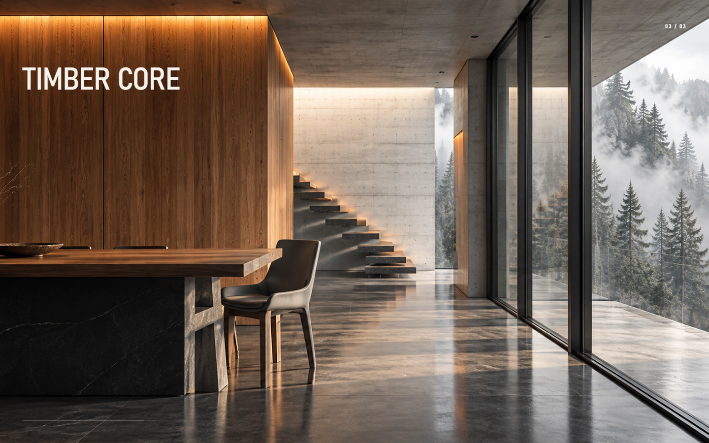

运行方式：在 `labs_1` 目录执行 `python scripts/serve.py`，打开 `http://127.0.0.1:5188/`。

## 实验二：沉浸式未来世界页面

[进入 `labs_2/immersive-future`](labs_2/immersive-future/) · [设计分析](labs_2/immersive-future/design.md) · [动效分析](labs_2/immersive-future/motion.md) · [素材计划](labs_2/immersive-future/assets.md) · [复盘](labs_2/retrospective.md)

以未来世界为独立主题，尝试把参考网站的编辑式排版、浅色空间层次、项目媒体与滚动动效重新组合。实现使用 React、Vite 和 GSAP。画面已经可运行，但本轮实验**未达到预期的复刻效果**；复盘指出，素材、运动设计和浏览器验收需要更早地形成明确关卡。

下方依次为首页与四个项目章节的实际页面截图：

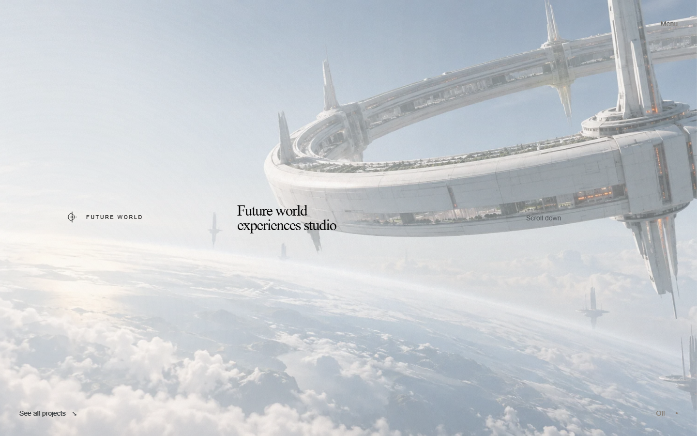
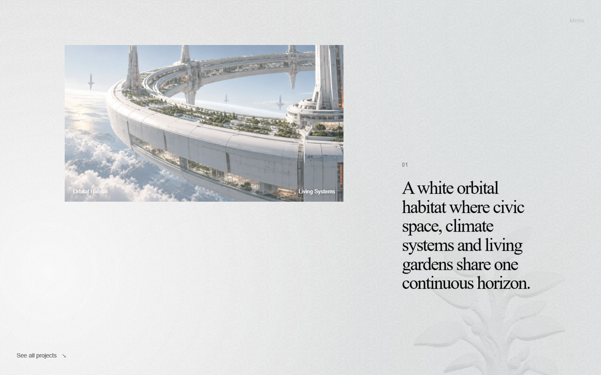
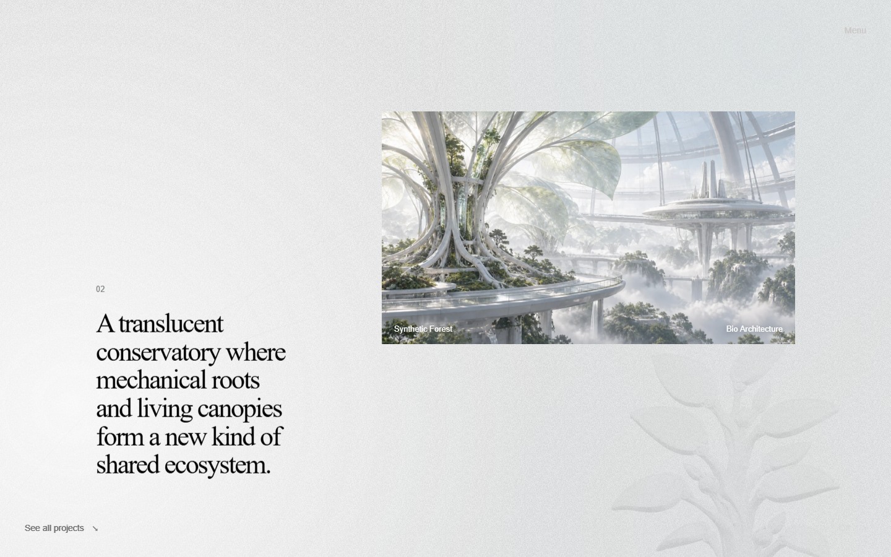
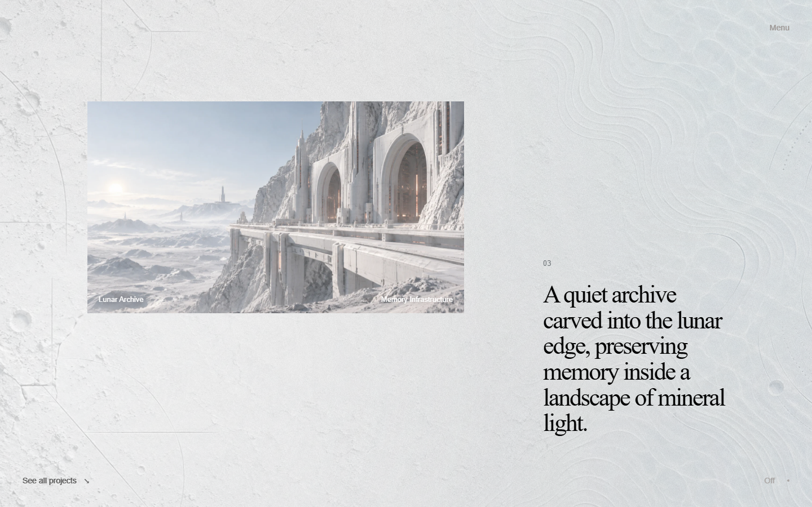
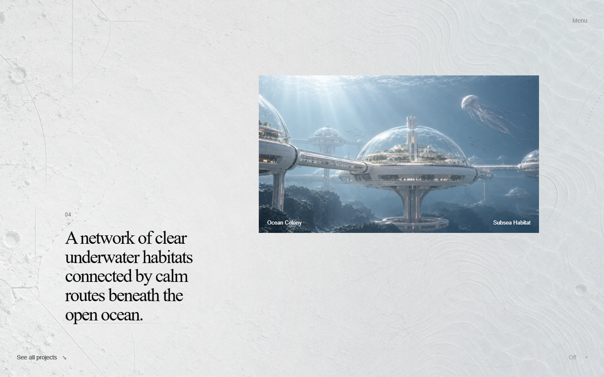

运行方式：在 `labs_2/immersive-future` 目录执行 `npm ci`、`npm run dev`，打开终端显示的本地地址。

## 实验三：维纳斯数字展览与滚动叙事

[进入 `labs_2/blender-loop-video`](labs_2/blender-loop-video/) · [制作记录](labs_2/blender-loop-video/experiment-log.md) · [展览页说明](labs_2/blender-loop-video/web-showcase/README.md)

这轮实验从多视角参考图与 3D 模型出发，在 Blender 中制作修复主题的雕塑、镜头和 10 秒循环视频，再把成片放进网页。它包含一个静态展览页，以及两种把滚动位置映射到画面的原型：视频时间轴和 Canvas 图片序列。两个原型用于比较滚动响应方式。

### 静态展览页

包含循环视频首屏、作品展示与材料说明。下图为浏览器整页截图：

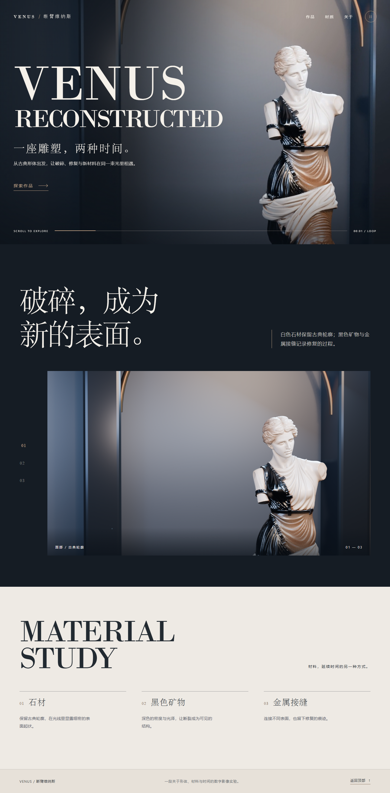

### 原型 A：视频时间轴

[查看原型说明](labs_2/blender-loop-video/web-showcase/prototypes/continuous-video-v1/README.md)。固定视频画面，滚动位置对应视频时间；文字与章节索引随镜头变化。

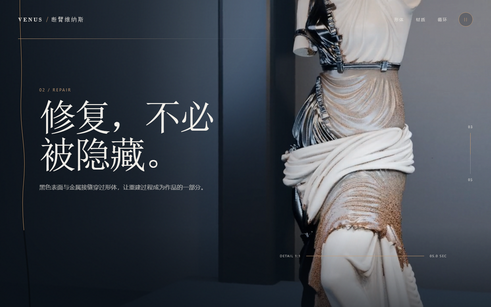

### 原型 B：Canvas 图片序列

[查看原型说明](labs_2/blender-loop-video/web-showcase/prototypes/continuous-video-v2-1080p/README.md)。使用 300 张 WebP 帧绘制滚动画面，并保留“直控 / 原生”滚轮模式供对照。

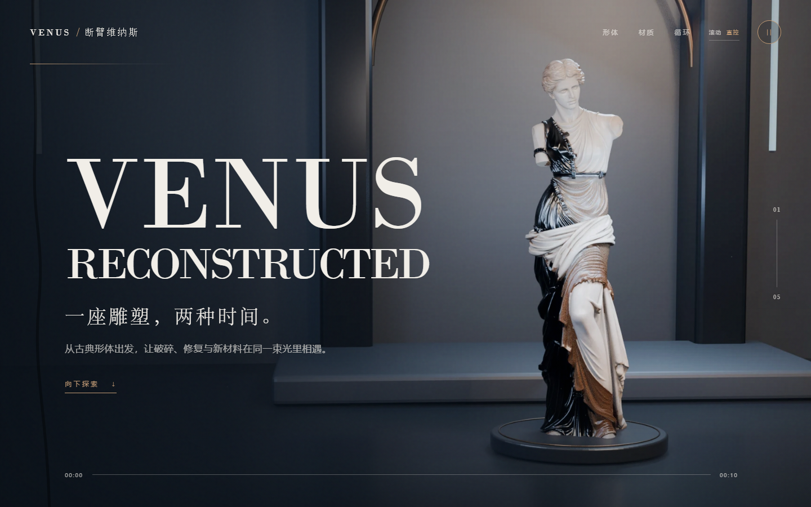
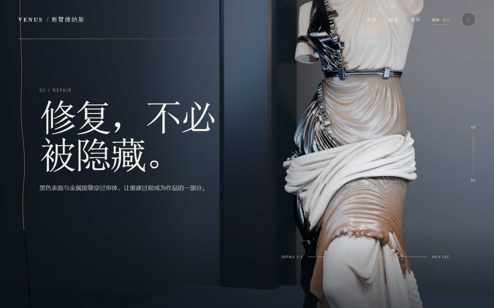

运行方式：在 `labs_2/blender-loop-video/web-showcase` 目录执行 `python -m http.server 5174 --bind 127.0.0.1`，然后访问：

- 展览页：`http://127.0.0.1:5174/`
- 视频原型：`http://127.0.0.1:5174/prototypes/continuous-video-v1/`
- Canvas 原型：`http://127.0.0.1:5174/prototypes/continuous-video-v2-1080p/`

## 关于截图

以上图片由 Chromium 在 1440 × 900 视口访问本地运行页面后截取，保存在 [`docs/screenshots`](docs/screenshots/) 中。滚动型页面使用不同滚动位置的视口截图；整页截图只用于普通文档流的维纳斯展览页。静态图片无法展示动效的连续性，建议运行页面并实际滚动查看。

Blender 工程、原始 3D 模型、模型生成输入图及未用于网页的原始视频保留在本地，不纳入 Git 仓库；网页运行所需的压缩素材与 README 截图仍随代码提交。
