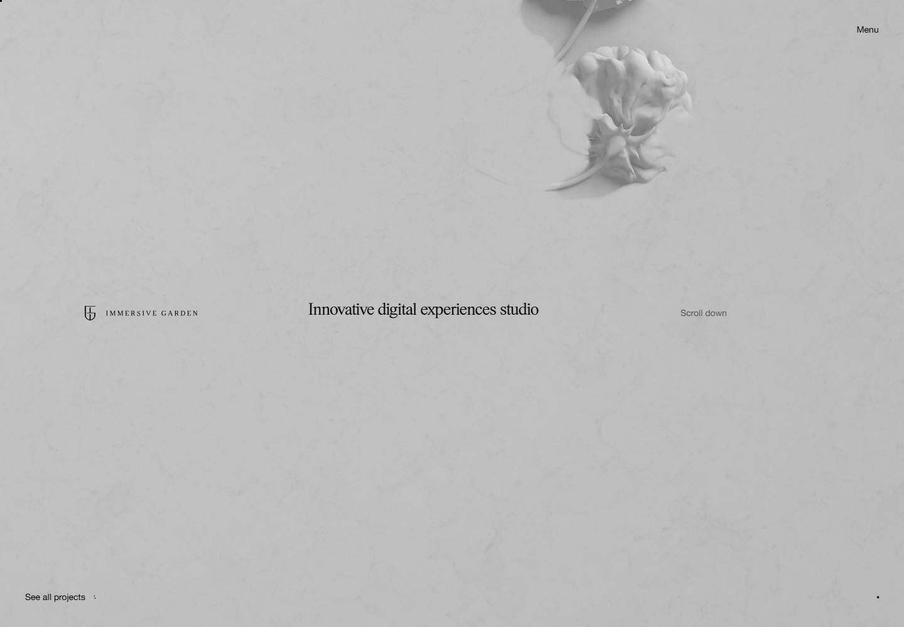
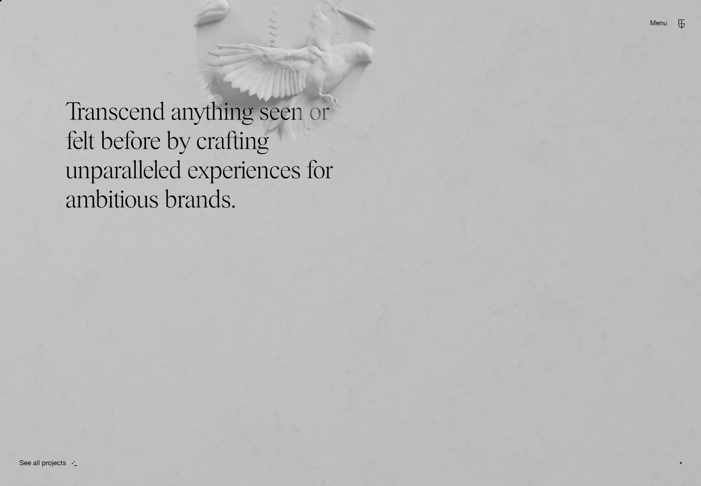
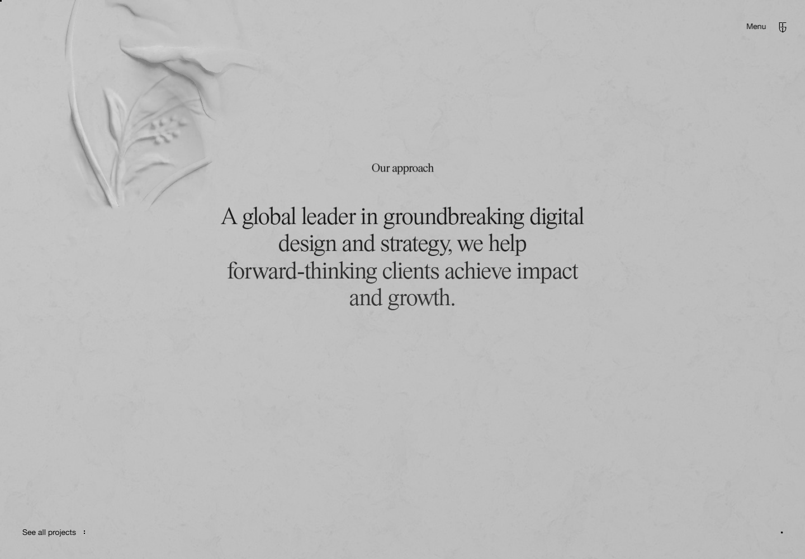
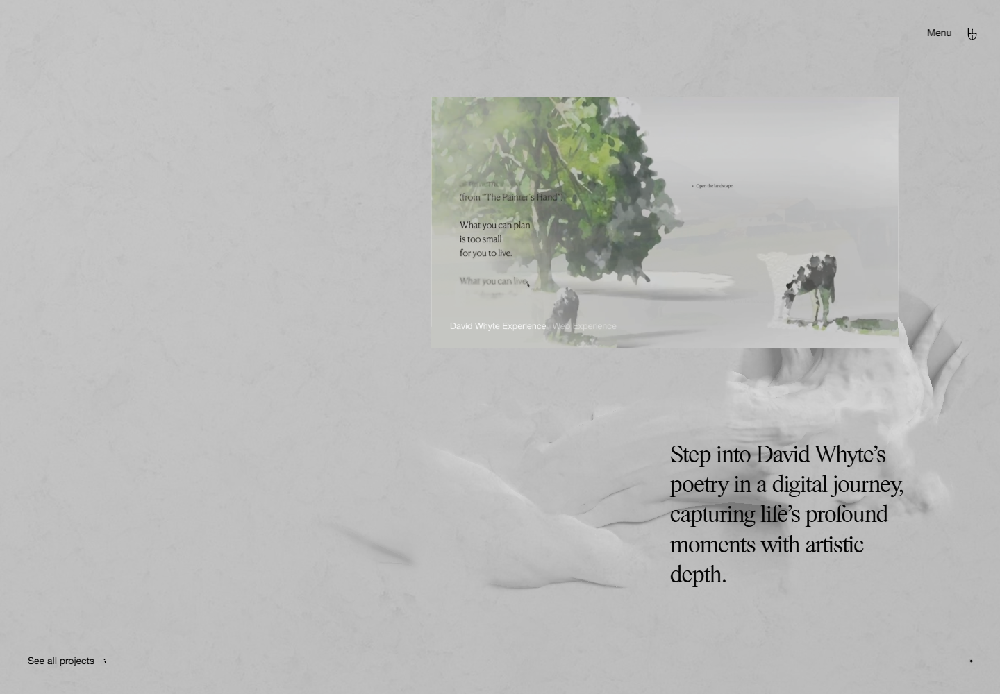
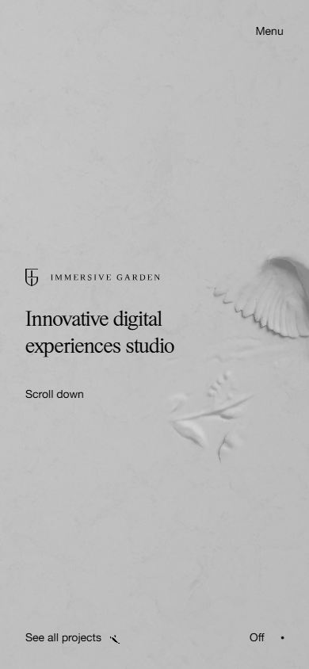
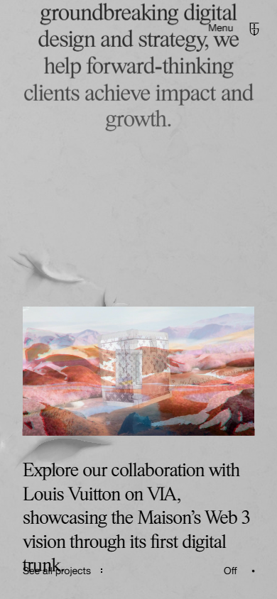

# 未来世界官网复刻：设计分析

> 参考站：[Immersive Garden](https://immersive-g.com/)  
> 分析时间：2026-09-20  
> 目标：复刻参考站的空间感、编辑式排版和长篇滚动节奏，但将内容与视觉主题改为“未来世界”。不复制原站品牌、项目文案或商业素材。

## 1. 设计结论

参考站最值得复刻的不是某一张图，而是一个非常克制的视觉系统：固定的浅灰材质背景、黑色衬线大字、少量无衬线 UI，以及持续穿过画面的浅浮雕 3D 世界。内容像杂志版面一样在同一个空间里依次出现，项目媒体悬浮在材质背景之上。

未来世界版本保留这套骨架，并将“石膏浮雕花鸟”替换为“白色未来遗迹”：轨道环、仿生机械、空间站剖面、城市地形和数据化植物。整体不做常见的黑底霓虹赛博朋克，而采用高亮、低饱和、近乎博物馆模型的未来感。

## 2. 参考站视觉证据

### 2.1 首屏

- 1440 × 1000 视口中，内容都贴着四周安全边距布置，中部保留大面积空白。
- 左中是品牌标志，中部是衬线短句，右上只有 `Menu`；左下项目入口、右下声音状态常驻。
- 背景不是纯色：浅灰纸张/石材纹理之上叠加白色低对比 3D 浮雕。
- 页面主色实测为背景 `rgb(232, 232, 232)`、正文近黑 `rgb(3, 3, 3)`。

### 2.2 宣言与方法论

- 宣言段使用约半屏宽的大号衬线文本，左对齐；方法论段转为居中，形成版面节奏变化。
- 3D 浮雕不占独立卡片，而是从画面边缘或文字背后进入，承担章节连接作用。
- 小标题使用窄小的无衬线字体，正文使用衬线字体；信息层级主要依赖字体与留白，不依赖边框和阴影。

### 2.3 项目叙事

- 一屏通常只突出一个项目；媒体框约占视口宽度的 45%–50%，正文约占 23%–28%。
- 媒体和文字采用错位、交替、非对称布局，不重复统一卡片网格。
- 项目标题和类别使用 14px 左右的无衬线信息条，描述为大号衬线正文。
- 媒体框本身几乎无装饰：直角、无厚边框、无重阴影，让画面内容成为焦点。

### 2.4 移动端

- 390 × 844 视口使用约 32px 左右的衬线主文案，左右边距约 32px。
- 首屏品牌、标题和滚动提示变成纵向组合；常驻的菜单、项目入口和声音开关仍占四角。
- 项目媒体改为接近满宽，正文紧随其后，桌面端的大幅错位被收敛为单列。
- 背景 3D 元素数量和对比度下降，以控制性能并避免遮挡文字。

## 3. 未来世界版本的信息架构

页面保持“单一长篇叙事”，不增加传统营销站的功能卡、价格表或数据面板。

| 顺序 | 章节 | 作用 | 建议画面 |
| --- | --- | --- | --- |
| 01 | 首屏 / Gateway | 建立品牌与未来世界入口 | 白色轨道环从右上掠过，微弱粒子漂浮 |
| 02 | 宣言 / Manifesto | 给出世界观主张 | 仿生飞行器与城市浮雕从顶部进入 |
| 03 | 方法 / Protocol | 说明创造方式 | 中央排版，背景为数据植物与机械结构 |
| 04 | 项目 01 / Orbital Habitat | 第一个视觉高潮 | 太空居住站外景视频或循环序列 |
| 05 | 项目 02 / Synthetic Forest | 改变色温与内容密度 | 生物科技森林、半透明树冠 |
| 06 | 项目 03 / Lunar Archive | 形成深层空间感 | 月面档案馆、远景地平线 |
| 07 | 项目 04 / Ocean Colony | 结束前的流动画面 | 水下未来城、发光航道 |
| 08 | 使命 / Mission | 收束世界观 | 大字号居中文案，3D 地球弧面 |
| 09 | 页脚 / Contact | 品牌与联系入口 | 低对比空间站剖面，极简联系方式 |

建议只做 4 个完整项目段，优先把每段的画面、转场和响应式完成度做高，而不是机械复刻参考站的 18 个项目条目。

## 4. 布局系统

### 4.1 桌面

- 设计基准：1440 × 1000；最小验收宽度 1280。
- 页面采用固定视口舞台，内容由虚拟滚动进度驱动；DOM 仍应保留可访问的语义结构。
- 安全边距：左右 40px，顶部 40–48px，底部 40–44px。
- 主内容网格：12 列，列间距 20–24px。
- 章节高度：首屏 100vh；宣言/方法段 120–160vh；每个项目段 130–180vh。
- 项目媒体常用宽度：6 列；描述 3–4 列；通过列起点交替产生错位。

### 4.2 移动

- 设计基准：390 × 844；覆盖 360–430px。
- 左右边距 32px，媒体宽度 `calc(100vw - 64px)`。
- 固定 UI 仍在四角，但要为系统安全区预留 `env(safe-area-inset-*)`。
- 章节改为自然单列，减少绝对定位；3D 场景作为背景层，不参与内容高度计算。
- 描述字号使用 `clamp(28px, 8vw, 36px)`，避免极窄屏出现孤字。

## 5. 视觉系统

### 5.1 色彩

| Token | 建议值 | 用途 |
| --- | --- | --- |
| `--bg` | `#E8E8E8` | 主背景，忠于参考站冷灰基底 |
| `--ink` | `#030303` | 主文字与 UI |
| `--muted` | `#777A7D` | 次要信息 |
| `--relief` | `#F3F4F4` | 未来遗迹/浮雕主体 |
| `--ice` | `#BFE9F2` | 媒体中的冷色强调 |
| `--signal` | `#FF5C35` | 极少量状态点或媒体内信号色 |

页面 UI 仍以灰黑为主，`--ice` 和 `--signal` 只进入媒体内容或非常小的状态反馈，避免把页面做成霓虹控制台。

### 5.2 字体

参考站实测使用 `PSTimes` 与 `HelveticaNeueRegular`。复刻项目不直接分发其字体文件，建议替代为：

- 展示衬线：`Cormorant Garamond` 或本地可授权的高对比衬线；回退 `Times New Roman, serif`。
- UI 无衬线：`Inter` / `Arial` / `sans-serif`。
- 桌面宣言：`clamp(52px, 4.2vw, 72px)`，行高 `0.98–1.06`。
- 桌面项目描述：`clamp(36px, 2.8vw, 48px)`，行高约 `1.08`。
- 移动主文案：28–36px，行高 `1.05–1.12`。
- UI：13–15px；品牌字标可用 11–12px、0.22em 字距。

### 5.3 组件与容器

- `PersistentChrome`：菜单、项目入口、声音状态、当前位置点。
- `HeroIdentity`：字标、短标题、滚动提示。
- `StatementBlock`：大号衬线文案，支持左对齐与居中两种变体。
- `ProjectChapter`：媒体、描述、项目元信息；左右交替而非卡片网格。
- `WorldCanvas`：固定全屏 3D 背景，独立处理性能降级。
- `MediaPlane`：图片/视频纹理平面，保持直角与轻微透视。
- `FooterPortal`：最终联络区与收尾 3D 场景。

## 6. 可访问性与降级

- 所有 Canvas 中出现的项目名称、描述和链接必须在 DOM 中保留；Canvas 只负责视觉表现。
- `prefers-reduced-motion: reduce` 时禁用惯性与 3D 相机位移，章节使用淡入，媒体保持静止。
- WebGL 不可用或低性能设备使用预渲染 WebP 背景；移动端默认加载低面数 GLB 与 1K 纹理。
- 声音默认关闭，开启后才创建/恢复 `AudioContext`；状态必须有文字而非只靠图标。
- 文字与背景维持至少 4.5:1 对比度；3D 对象经过文字区域时降低不透明度或移到文字背后。

## 7. 实现边界

- 保留：固定四角 UI、编辑式大字、虚拟滚动、WebGL 浮雕、非对称项目章节、可选声音。
- 替换：品牌、文案、所有项目媒体、3D 模型、音频与项目数量。
- 不复刻：原站商标、客户项目、受版权保护的图像/视频、字体文件和源码。
- 不新增：卡片墙、霓虹渐变、玻璃拟态面板、数据仪表盘、营销徽章或无意义指标。

